## Repo Structure Setup

This is simply done by using the `mkdir` and `touch` command. 

Here is the following command we used: 

```bash
$ mkdir -p soal_1 soal_2/scripts soal_3 soal_4 && touch ./soal_1/poppo_siroyo.sh ./soal_2/login.sh ./soal_2/register.sh ./soal_2/scripts/core_monitor.sh ./soal_2/scripts/frag_monitor.sh ./soal_2/scripts/manager.sh ./soal_2/terminal.sh ./soal_3/dsotm.sh ./soal_4/pokemon_analysis.sh

```

## Local Repo Setup

### 1. Clone Remote Repository

We can clone the remote repo to our local repo by using the [HTTPS Link](https://github.com/zelebwr/Sisop-1-2025-IT05.git) or the [SSH Link](git@github.com:zelebwr/Sisop-1-2025-IT05.git) and then simply use the following command:

```bash
$ git clone <link>
```

### 2. Enable All File's Run Permission

We can easily enable the run permission on every file by using the -R (recursive) flag after moving to the local repo in our device. Do this command when met with **Running** permission problem:

```bash
$ chmod -R +x .
```

## C. Challenge Operation

### Soal 1 – Poppo Siroyo Adventure^^
First thing to be done is to declare the shell environment with: 

```bash
#!/bin/bash
```

The above is to declare that shell will be run in a bash shell environment.
Next, download the csv file using **curl**.

```bash
DATA=$(curl -s -L "https://drive.google.com/uc?export=download&id=1l8fsj5LZLwXBlHaqhfJVjz_T0p7EJjqV")
```

Don't forget to give your program a menu-to help Poppo&Siroyo deciding their choice.

```bash
echo "##########################
Selamat Datang Di Suka Maju Data & Learning

Ketik :
1. Mencari Data Chris Hemsworth
2. Mencari Rata-Rata Durasi Membaca Dengan Tablet
3. Mencari Pembaca Dengan Rating Tertinggi
4. Mencari Genre Ter-Populer Di Atas 2023"
```

You also have to collect their choice, use ↓↓↓

```bash
read -p "Masukkan Menu Pilihanmu : " menu
```
#### Here's the result:
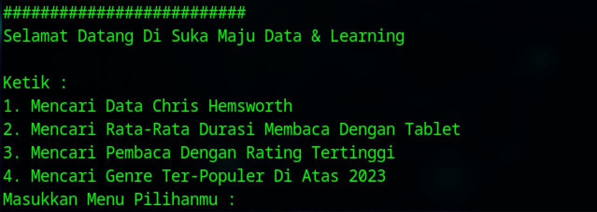


Now we're moving to the challenges they'll face!
1. Poppo is eager to know how many books Chris Hemsworth has read! Let's build a system that fetches and processes the data to reveal the answer.

```bash
if [ "$menu" -eq 1 ]; then
echo "$DATA" | awk -F',' '
NR==1 {next}
$2 == "Chris Hemsworth" {count++}
END {printf "Chris Hemsworth membaca %d buku.\n", count}
'
```
> Using if feature, adjusting Poppo&Siroyo needs. Try to show the data and filter Chris's name.
#### Here's the result:


2. Siroyo, always the analyst, wants to know how long people read using the magic tablet. Let's build a system that fetches and processes the data to reveal the answer.
   
```bash
elif [ "$menu" -eq 2 ]; then
echo "$DATA" | awk -F',' '
NR==1 {next}
$8 == "Tablet" { total += $6; count++ }
END {printf "Rata-rata durasi membaca dengan Tablet adalah %.1f menit.", total/count}'
```
> Using if feature, adjusting Poppo&Siroyo needs. Try to show the data and count the average time of people reading by Tablets.
#### Here's the result:
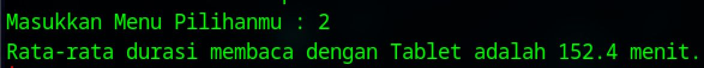

3. While Siroyo is busy analyzing the magic tablet, Poppo comes up with a brilliant idea. 'If we already know how they read, I want to reward the friend who loves their book the most!' Poppo then sets out to find the person who gave the highest rating, along with their name and the book title.

```bash
elif [ "$menu" -eq 3 ]; then
echo "$DATA" | awk -F',' '
NR==1 {next}  # Skip header
$7 > ratingMax {ratingMax=$7; count=0}  # Reset jika ada rating lebih tinggi
$7 == ratingMax {arr[count++] = $2 " - " $3}  # Simpan dalam array jika rating sama
END {printf "Pembaca dengan rating tertinggi (%.1f):\n", ratingMax;
    for (i=0; i<count; i++)
    {
        printf "%d. %s\n", i+1, arr[i];
    }
}'
```
> Using if feature, adjusting Poppo&Siroyo needs. Try to show the data and find the highest rate given by the readers.
#### Here's the result:
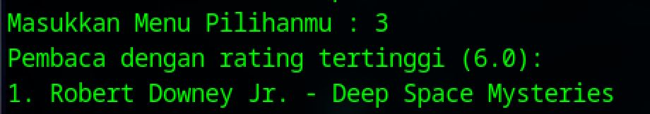

4. Siroyo needs a stellar book club report! Curious about Asia’s top genre after 2023, he reopens reading_data.csv.

```bash
elif [ "$menu" -eq 4 ]; then
echo "$DATA" | awk -F',' '
NR==1 {next}
substr($5, 1, 4) > "2023" && $9 == "Asia" { genreCount[$4]++ }
END {
    genremax = ""; hitungmax = 0;
    for (g in genreCount)
    {
        if (genreCount[g] > hitungmax)
        {
            hitungmax = genreCount[g];
            genremax = g;
        }
    }
    if (genremax != "")
        printf "Genre paling populer di Asia setelah 2023 adalah %s dengan %d buku.\n", genremax, hitungmax;
}'
```
> Using if feature, adjusting Poppo&Siroyo needs. Try to show the data and discover the best (top) genre of books after 2023.
#### Here's the result:


The last thing needed to do is to "close" the program using this magic word↓↓↓

```bash
fi
```

### Soal 2 - Game Kece
#### Login Script (`login.sh`)

First, define the script as a bash script by adding the shebang line:

```bash
#!/bin/bash
```

Then, define the necessary path variables to locate the database file:

```bash
SCRIPT_DIR=$(dirname "$(realpath "$0")")
DB_PATH_PLYR="$SCRIPT_DIR/data/player.csv"
```

Next, check if the database exists:

```bash
if [ ! -e $DB_PATH_PLYR ]; then
    echo "Database not found. Please register first."
    echo "Run script register.sh to register" 
    exit 1
fi
```

The script then prompts the user to enter an email and password, validating them against the database:

```bash
echo -e "\nLogin\n"
while true; do
    echo -n "Email: "
    read EMAIL
    if [ -z "$EMAIL" ]; then
        echo -e "\nEmail cannot be empty. Please enter a valid email.\n"
    elif ! grep -q "$EMAIL" "$DB_PATH_PLYR"; then
        echo -e "\nEmail \"$EMAIL\" not found. Please enter a valid email.\n"
    else
        break
    fi
done

while true; do
    echo -n "Password: "
    read -s PASSWORD
    if [ -z "$PASSWORD" ]; then
        echo -e "\nPassword cannot be empty. Please enter a valid password.\n"
    elif ! grep -q "$EMAIL.*$PASSWORD" "$DB_PATH_PLYR"; then
        echo -e "\nIncorrect password.\n"
    else
        break
    fi
done

USERNAME=$(awk -F, -v mail="$EMAIL" -v pass="$PASSWORD" '$1==mail && $3==pass {print $2}' "$DB_PATH_PLYR") 

if [ -z "$USERNAME" ]; then
    echo -e "\nLogin failed.\n"
else
    echo -e "\nLogin successful. Welcome back, $USERNAME.\n"
fi
```

---
#### Here's the result:


### Register Script (`register.sh`)

The script begins by setting up the database file if it doesn't exist:

```bash
SCRIPT_DIR=$(dirname "$(realpath "$0")")
DB_PATH_PLYR="$SCRIPT_DIR/data/player.csv"
DB_HEADER=$(echo -e "email,username,password\n")

if [ ! -e $DB_PATH_PLYR ]; then
    mkdir -p $SCRIPT_DIR/data && touch $DB_PATH_PLYR
    echo "$DB_HEADER" > $DB_PATH_PLYR
fi
```

Then, it prompts the user to enter a username, email, and password, validating each input:

```bash
echo -e "\nRegister new player\n"
while true; do
    echo -n "Username: "
    read USERNAME
    if [ -z "$USERNAME" ]; then
        echo -e "\nUsername cannot be empty.\n"
    else
        break
    fi
done

while true; do
    echo -n "Email: "
    read EMAIL
    if [ -z "$EMAIL" ]; then
        echo -e "\nEmail cannot be empty.\n"
    elif grep -q "$EMAIL" "$DB_PATH_PLYR"; then
        echo -e "\nEmail \"$EMAIL\" already exists.\n"
    else
        break
    fi
done

while true; do
    echo -n "Password: "
    read -s PASSWORD
    if [ -z "$PASSWORD" ]; then
        echo -e "\nPassword cannot be empty.\n"
    else 
        break
    fi
done

echo "$EMAIL,$USERNAME,$PASSWORD" >> $DB_PATH_PLYR
```

---
#### Here's the result:
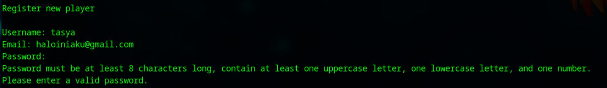

### Terminal Interface (`terminal.sh`)

This script provides a menu for user interaction:

```bash
#!/bin/bash

SCRIPT_DIR=$(dirname "$(realpath "$0")")
LOGIN_DIR="$SCRIPT_DIR/login.sh"
REGISTER_DIR="$SCRIPT_DIR/register.sh"

while true; do
    clear
    cat << EOF
========================================
     Welcome to the Game Terminal
========================================
1. Sign Up
2. Log In
3. Exit
========================================
Choose an option:
EOF
    read OPTION
    case $OPTION in
        1)
            bash "$REGISTER_DIR"
            ;;
        2)
            bash "$LOGIN_DIR"
            ;;
        3)
            echo -e "\nGoodbye!"
            exit 0
            ;;
        *)
            echo -e "\nInvalid option. Try again.\n"
            ;;
    esac
    echo -e "\nPress Enter to continue..."
    read
done
```
#### Here's the result:
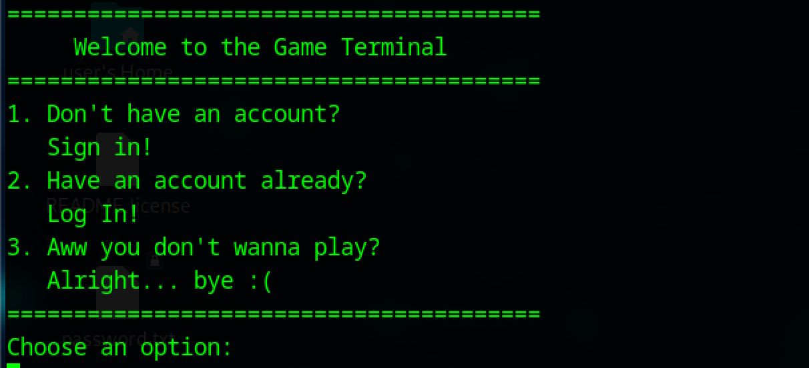

exit program
#### Here's the result:


#### Before revision: 
in login.sh

```bash
elif ! grep -q ".*$EMAIL,$PASSWORD" "$DB_PATH_PLYR"; then
```
It prevents invalid email formats from being checked against the database.

and

```bash
$USERNAME=$(awk -F, -v mail="$EMAIL" -v pass="$PASSWORD" '$1==mail && $3==pass {print $2}' "$DB_PATH_PLYR")
```
It will causes an error because $USERNAME is being treated as a command instead of a variable assignment.

### Soal 3 - CLI UI/UX Gacor
#### dsotm.sh

> dsotm.sh is a Bash script containing five tracks from The Dark Side of the Moon, each producing different terminal outputs. When executed, the script first clears the terminal to ensure that its effects are displayed correctly without interference.
>  The script must be run using the following format:
```bash
./dsotm.sh --play=”<Track>"
 ``` 

> where **<Track>** represents one of the selected song names. This is required for the script to function properly.

```bash
#!/bin/bash
```
is called a shebang. It tells the system to execute the script using the Bash shell

```bash
clear
```
Clears the terminal before running the script to ensure a clean display.
```bash
if [[ "$1" =~ ^--play= ]]; then 
    TRACK="${1#--play=}"
```
Checks if the first argument matches the expected format, then assigns it to the ```TRACK``` variable.
```bash 
case "$TRACK" in
```
Uses ``` case ``` to determine the action based on the selected song.
### 1. Track : Speak to Me 
> Mode Details: Displays given affirmation quotes with terminal effects`
```bash
curl -s https://raw.githubusercontent.com/annthurium/affirmations/refs/heads/main/affirmations.js | sed '1d;$d' | tr -d '",;]' | while IFS= read -r line; do
    echo "$line"
    sleep 1
done
```
Fetches data from the Affirmations API and removes the first and last lines and unnecessary characters from the API response. 
The loop prints each affirmation with a 1-second delay.

#### Here's the result:
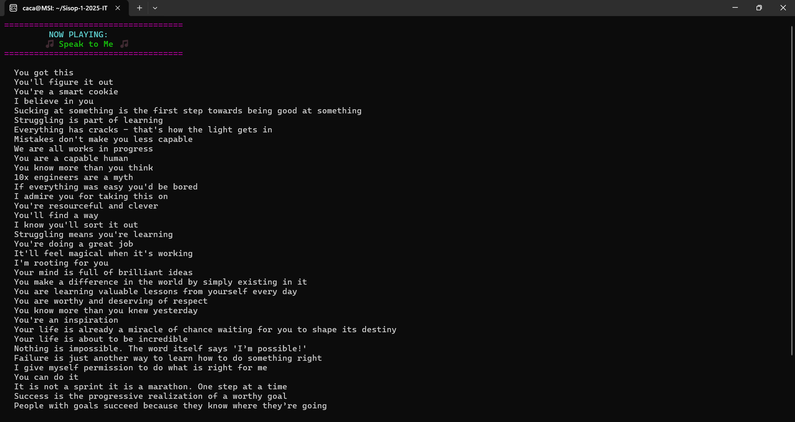

### 2. Track : On the Run
>  Mode Details : Displays a loading animation with a progress bar

```bash
while [ $PROGRESS -lt 100 ]; do
    sleep $(awk 'BEGIN{srand(); print 0.1 + rand()*0.9}')
    printf "\r[%-*s] %d%%" "$BAR_LENGTH" "$(head -c $((BAR_LENGTH * PROGRESS / 100)) < /dev/zero | tr '\0' '#')" "$PROGRESS"
    PROGRESS=$((PROGRESS + (RANDOM % 10) + 1))
    [ $PROGRESS -gt 100 ] && PROGRESS=100
done
```
Creates a while loop that runs while ```PROGRESS``` is less than 100%, with a random delay between 0.1 and 1 second. Each progress step is updated with a random value, ensuring the progress bar reaches exactly 100% at the end.
```printf``` is used to display a progress bar.
#### Here's the result:
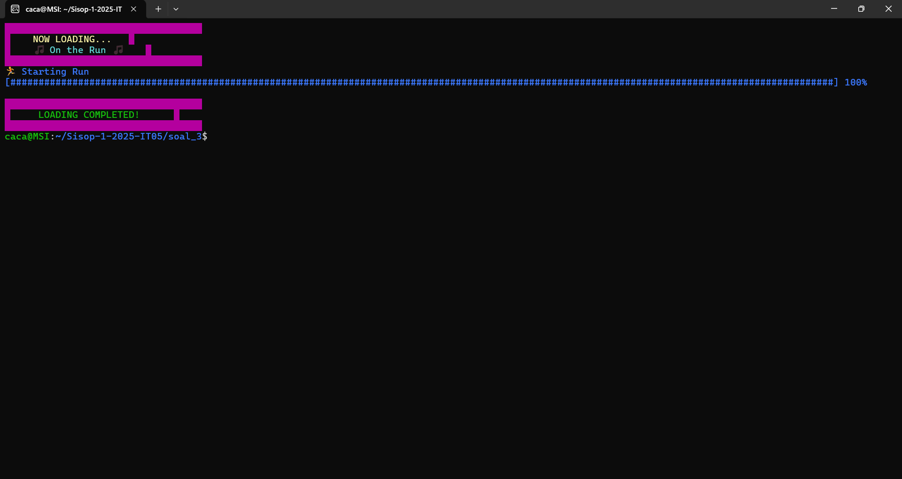

### 3. Track : Time
>  Mode Details : Real-Time Clock with Cron Job
```bash
if crontab -l | grep -q "$SCRIPT_PATH --play=\"Time\""; then
    echo "Cron job already exists."
else
    (crontab -l 2>/dev/null; echo "* * * * * $SCRIPT_PATH --play=\"Time\"") | crontab -
    echo "Cron job successfully added."
fi

while true; do
    clear
    echo "⏳ REAL-TIME CLOCK ⏳"
    echo "----------------------"
    date +"%Y-%m-%d %H:%M:%S"
    sleep 1
```
Checks if a cron job for the script already exists.
 If not, it adds a new cron job to run every minute.

The loop continuously updates and displays the current time.
#### Here's the result:
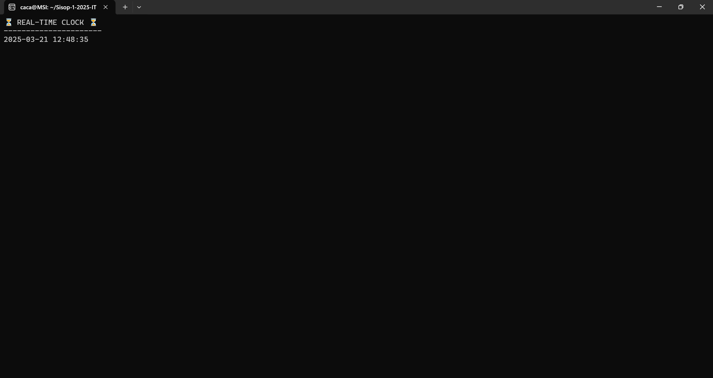

### 4. Track : Money
>  Mode Details : Displays a "rain" effect of currency symbols in the terminal, similar to cmatrix but with currency symbols ($, €, £, ¥, etc.)

```bash
symbols=( "$" "€" "£" "¥" "¢" "₹" "₩" "₿" "₣" )
cols=$(tput cols) 

heights=()
for (( i=0; i<$cols; i++ )); do 
    heights[i]=$(( RANDOM % 5 + 1 )) 
done

while true; do
    line=""
    for (( i=0; i<$cols; i++ )); do
        if (( RANDOM % heights[i] == 0 )); then 
            if (( RANDOM % 2 == 0 )); then 
                color="\e[35m" 
            else
                color="\e[37m" 
            fi
            line+="$color${symbols[RANDOM % ${#symbols[@]}]} \e[0m"
        else
            line+="  "
        fi
    done
    echo -e "$line"
    sleep 0.1
done
```
```symbols=( "$" "€" "£" "¥" "¢" "₹" "₩" "₿" "₣" )``` List of currency symbols.

```cols=$(tput cols)``` Gets the number of columns in the terminal.

```heights[i]=$(( RANDOM % 5 + 1 ))``` Randomizes the height of falling symbols per column.

```while true; do``` Infinite loop for continuously displaying symbol, then Randomly decides whether to show a symbol in a column. Also Randomly assigns purple (35) or white (37) color.

```sleep 0.1``` Slows down the effect for a smoother animation
#### Here's the result:
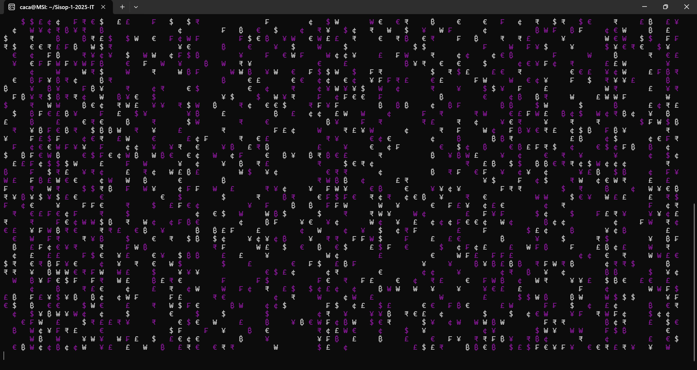

### 5. Track : Brain Damage
>  Mode Details : Displays a list of system processes, functioning like a simplified task manager, updating every second
```bash
 while true; do
        clear

         echo -e "\e[1;31m========================== B R A I N  D A M A G E ==========================\e[0m\n"
         echo -e "\e[1;31mPID         USER            PR      NI        CPU%       MEM%       COMMAND\e[0m"
         echo -e "\e[1;31m----------------------------------------------------------------------------\e[0m"

        top -b -n 1 -o %CPU | awk 'NR>7 {
                if (NR % 2 == 0)
                printf "\033[1;37m%-12s %-15s %-7s %-7s %-10s %-10s %-s\033[0m\n", $1, $2, $3, $4, $9, $10, $12;
                else
                    printf "\033[38;5;250m%-12s %-15s %-7s %-7s %-10s %-10s %-s\033[0m\n", $1, $2, $3, $4, $9, $10, $12;
        }' | head -n 10

        sleep 1
        done
```
Clears the terminal before each update.
Displays a formatted table with PID, USER, Priority, CPU%, MEM%, and Command.
Updates every second to reflect live system changes.
Alternates row colors for better readability.
#### Here's the result:
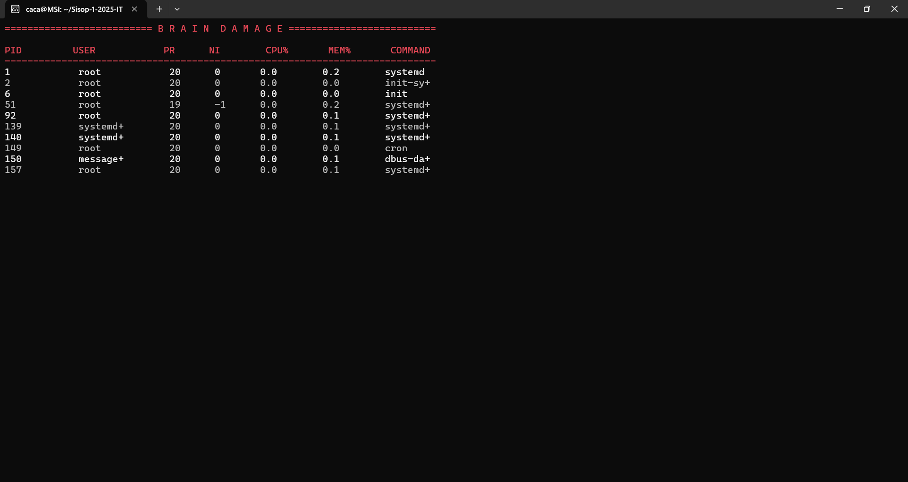

```bash
        *)
            echo "Error."
            ;;
    esac
else
	echo "Use: ./dsotm.sh --play=\"Song Name\""
fi
```
```echo "Error." ``` Displays an error message if the input is invalid. 

```echo "Use: ./dsotm.sh --play=\"Song Name\""```  Provides the correct usage instructions to the user.If the initial condition is not met (invalid argument).


#### Before Revision : Track 5. Brain Damage
```bash
while true; do
    echo -e "\e[1;37m=== Brain Damage ===\e[0m"
    echo ""

    ps aux --sort=-%cpu | awk 'NR<=11' | awk '{
        if (NR % 2 == 0) 
            print "\033[1;37m" $0 "\033[0m";
        else
            print "\033[38;5;110m" $0 "\033[0m";
    }'

    sleep 1
    clear
done
	;;
```
```while true; do``` Infinite loop for continuously updating the process list.
  Retrieves the top 10 CPU-intensive processes.

Color Formatting: white for even rows and light blue for odd rows.

```sleep 1``` Refreshes the display every second.

```clear``` Clears the screen before printing new data.
> The command was revised from ps aux --sort=-%cpu to top -b -n 1 -o %CPU, extracting processes from line 8 onward (NR>7), with improved formatting using printf and ANSI colors for better readability.


## Soal 4 Pokemon Analysis

### Summary data [REVISION]

Command used : 
```bash 
$ ./pokemon_analysis.sh --info
```

Output: 


Background command on line 421: 
```bash
# info the document
if [ $INFO_CHECK -eq 1 ]; then
	archaic_message

    echo "$CSV_FILE" | awk -F, '
        NR==1 { 
            for (i=2; i<=NF; i++) header[i] = $i; 
            next 
        }
        {
            for (i=2; i<=NF; i++) {
                if ($i+0 > max_val[i]+0) {
                    max_val[i] = $i;
                    max_row_value[i] = $1;  # Store corresponding first column value
                }
            }
        }
        END {
            for (i=2; i<=NF; i++)
                if (max_val[i] != "") 
                    print "The highest value in column " header[i] " is " max_val[i] ", by " max_row_value[i] ".";
        }'
fi
```

Explanation: 

1. 

```bash
if [ $INFO_CHECK -eq 1 ]; then
```

The above is to check if user used the info option

2. Archaic message

```bash 
archaic_message
```

The above code is just a function that outputs an archaic english message

3.  echo | awk

```bash 
echo "$CSV_FILE" | awk -F, '
        NR==1 { 
            for (i=2; i<=NF; i++) header[i] = $i; 
            next 
        }
        {
            for (i=2; i<=NF; i++) {
                if ($i+0 > max_val[i]+0) {
                    max_val[i] = $i;
                    max_row_value[i] = $1;  # Store corresponding first column value
                }
            }
        }
        END {
            for (i=2; i<=NF; i++)
                if (max_val[i] != "") 
                    print "The highest value in column " header[i] " is " max_val[i] ", by " max_row_value[i] ".";
        }'
```

`echo` command is used to pipe the csv_file data  into the `awk` command

```bash 
 awk -F, 'NR==1 { 
            for (i=2; i<=NF; i++) header[i] = $i; 
            next 
        }
        {
            for (i=2; i<=NF; i++) {
                if ($i+0 > max_val[i]+0) {
                    max_val[i] = $i;
                    max_row_value[i] = $1;  # Store corresponding first column value
                }
            }
        }
        END {
            for (i=2; i<=NF; i++)
                if (max_val[i] != "") 
                    print "The highest value in column " header[i] " is " max_val[i] ", by " max_row_value[i] ".";
        }'
```

The awk here is for declaring CSV header into the header array in awk, then looping through all of the rows starting from the second column to get the maximum values from each of the column. 

Using `max_val[i]+0` it will automatically not take string values. 

The loop will get the first column value (pokemon name) with the highest value of the designated column, so the output can tell which pokemon it was with for what column and with the the highest value of the said column. 

### Sort the Pokemon based on a Column [REVISION]

Used command: 

```bash 
./pokemon_analysis.sh -s -c 1 -R
``` 

Output: 

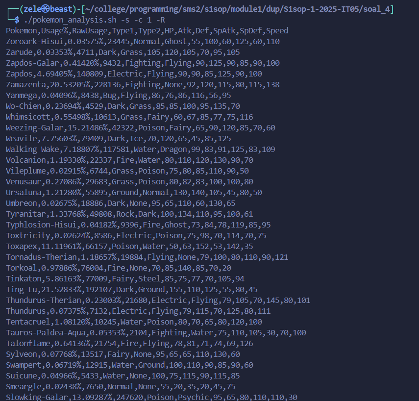

Alternative command: 

```bash 
./pokemon_analysis.sh -s -c 2 -R
```

Output: 

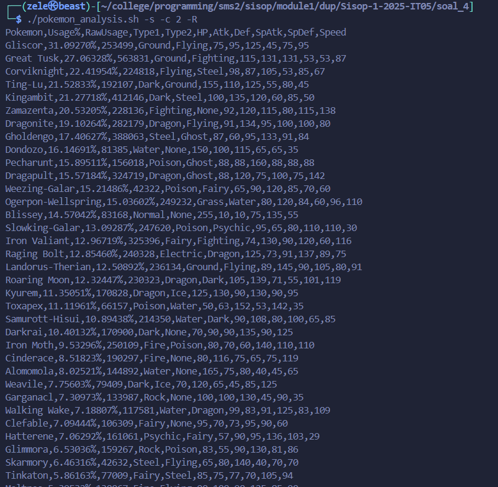

Background command to run on line 448: 

```bash
# sort the document
if [[ $SORT_CHECK -eq 1 ]]; then
	if [[ $SORT_REVERSE -eq 0 ]]; then # ascending
		CSV_FILE=$(echo "$CSV_FILE" | sort -t, -nk$SORT_COLUMN) 
	elif [[ $SORT_REVERSE -eq 1 ]]; then # descending
		CSV_FILE=$(echo "$CSV_FILE" | sort -t, -nrk$SORT_COLUMN)
	fi
fi
```

Explanation: 

1. if condition 

```bash 
if [[ $SORT_CHECK -eq 1 ]]; then
```

The command above checks if the user wanted to sort the data from the csv file or not

2. another if condition

```bash 
if [[ $SORT_REVERSE -eq 0 ]]; then # ascending
... 
elif [[ $SORT_REVERSE -eq 1 ]]; then # descending
...
```

The command above checks if the user wanted to sort in an ascending order or descneding order

3. The main command

```bash 
CSV_FILE=$(echo "$CSV_FILE" | sort -t, -nk$SORT_COLUMN) 
```  

The command above is the main command to do the sorting

`echo` is the command to pipe in the data form the csv_file into sort `sort` command

The -t flag in `sort` is for declaring the delimiter, which is `,` in this context

The -nk is for sorting based on string numerical value on what column i.e., the `$SORT_COLUMN`

### Find the name of the pokemon

```bash 
./pokeomon_analysis.sh -f Chansey
```

Output: 
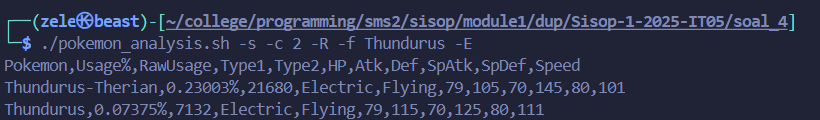

Running Code in background on line 458: 
```bash 
# find the document
if [[ $FIND_CHECK -eq 1 ]]; then

	if [[ "$USE_SECOND_COLUMN" -eq 1 ]]; then
        CSV_TAIL=$(echo "$CSV_FILE" | awk -F, -v col1="$FIND_COLUMN1" -v col2="$FIND_COLUMN2" -v val="$FIND_VALUE" '
            $col1 ~ val || $col2 ~ val { print $0 }
        ')
    else
        CSV_TAIL=$(echo "$CSV_FILE" | awk -F, -v col1="$FIND_COLUMN1" -v val="$FIND_VALUE" '
            $col1 ~ val { print $0 }
        ')
    fi

	# check if the value is found
	if [[ -z "$CSV_TAIL" ]]; then
        echo "The string \"$FIND_VALUE\" could not be found in column $FIND_COLUMN."
        exit 1
    fi

	 # Continue processing if the string is found
    if [[ $OUTPUT_TYPE == "-r" ]] || [[ $OUTPUT_TYPE == "--row" ]]; then
        echo "$CSV_HEADER"
        echo "$CSV_TAIL"
    elif [[ $OUTPUT_TYPE == "-f" ]] || [[ $OUTPUT_TYPE == "--focused" ]]; then
        echo "$CSV_TAIL" | grep -o "$FIND_VALUE"
        echo -n "The amount of occurrences of the focused value is: "
        echo "$CSV_TAIL" | grep -o "$FIND_VALUE" | wc -l
    fi
fi
```

Explanation

1. A bunch of if conditions: 

```bash
if [[ $FIND_CHECK -eq 1 ]]; then
```

The command above to check if user wanted to find a pattern or some sort

```bash
if [[ "$USE_SECOND_COLUMN" -eq 1 ]]; then
```

The command above to check if user wanted to find pattern at 2 columns


```bash
if [[ -z "$CSV_TAIL" ]]; then
```

The command above checks out if the searched pattern is there or not


```bash
if [[ $OUTPUT_TYPE == "-r" ]] || [[ $OUTPUT_TYPE == "--row" ]]; then
```

The command above to check if the user wanted output based on row


```bash
elif [[ $OUTPUT_TYPE == "-f" ]] || [[ $OUTPUT_TYPE == "--focused" ]]; then
```

The command above to check if the user wanted output based on just the value 


```bash
CSV_TAIL=$(echo "$CSV_FILE" | awk -F, -v col1="$FIND_COLUMN1" -v col2="$FIND_COLUMN2" -v val="$FIND_VALUE" '
```

```bash
CSV_TAIL=$(echo "$CSV_FILE" | awk -F, -v col1="$FIND_COLUMN1" -v val="$FIND_VALUE" '
```

```bash

```

```bash

```

```bash

```

